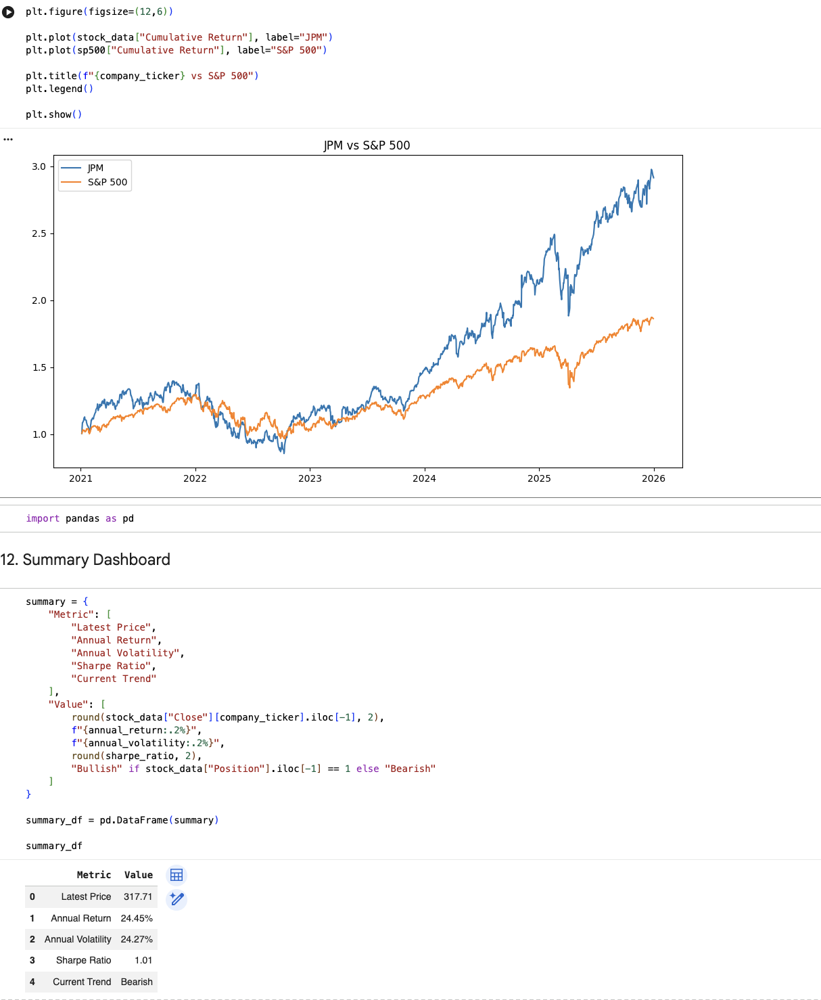

# Python Equity Research & Portfolio Analytics

## Overview

This project is a Python-based equity research and portfolio analytics tool that combines individual stock analysis with multi-asset portfolio optimisation.

The project uses historical market data from Yahoo Finance to evaluate stock performance, risk, technical indicators and benchmark-relative returns. It then extends the analysis to portfolio construction by examining correlations, simulating 10,000 portfolio allocations and identifying maximum Sharpe ratio and minimum volatility portfolios.

## Features

### Equity Research
- Historical stock price analysis
- Daily and cumulative returns
- Annual return and annual volatility
- 50-day and 200-day moving averages
- Moving-average crossover buy/sell signals
- Sharpe ratio analysis
- Performance comparison against the S&P 500
- Reusable single-ticker input for analysing different companies

### Portfolio Analytics
- Multi-stock portfolio analysis
- Daily and annualised return calculations
- Annualised volatility analysis
- Correlation analysis to assess diversification
- Simulation of 10,000 randomly weighted portfolios
- Risk-return analysis
- Maximum Sharpe ratio portfolio identification
- Minimum volatility portfolio identification
- Optimal portfolio allocation comparison

## Portfolio Methodology

The portfolio section analyses JPM, MSFT, AAPL, NVDA and GOOGL using historical market data from 2021–2025.

For each simulated portfolio, the model calculates:

- Expected annual return
- Annualised portfolio volatility
- Sharpe ratio
- Individual security weights

The model then compares the simulated portfolios to identify the allocation with the highest Sharpe ratio and the allocation with the lowest overall volatility.

## Tools & Libraries

- Python
- pandas
- NumPy
- Matplotlib
- yfinance
- Google Colab

## Key Concepts

- Equity research
- Risk and return
- Volatility
- Sharpe ratio
- Portfolio diversification
- Correlation
- Portfolio optimisation
- Risk-adjusted returns

- ## Visualisations

### Equity Performance vs S&P 500

### Portfolio Risk-Return Analysis

### Optimal Portfolio Allocations

## Limitations

The analysis is based on historical market data and should not be interpreted as a prediction of future performance.

The portfolio model uses a simplified Sharpe ratio assuming a 0% risk-free rate. Transaction costs, taxes and other practical investment constraints are not incorporated.

## Disclaimer

This project was developed for educational and analytical purposes and does not constitute investment advice.
